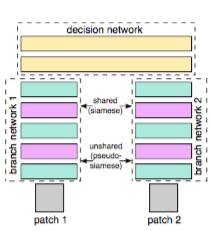
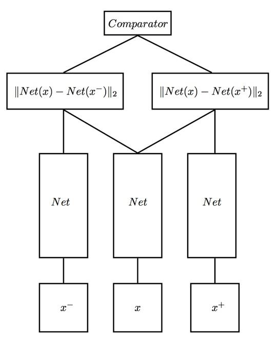
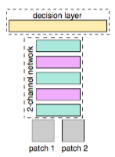
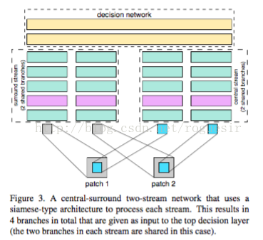

# DeepLearning

@2019

## Siamese Network

在05年由Yann Lecun提出来的。用于衡量两个输入的相似程度。这个算法最初用于手写签字的识别，之后又应用在相似图片的处理上面，如下图所示，patch1和patch2为输入图片，两张图片分别经过卷积层（包括卷积、ReLU、最大池化等过程），得到两个特征向量，接着进入黄色的全连接层，最后输出两个图片的相似度。在Siamese Network算法中，两个patch在卷积层中的权值共享。

- 孪生神经网络（siamese network）中，其采用的损失函数是contrastive loss，这种损失函数可以有效的处理孪生神经网络中的paired data的关系。这种损失函数最初来源于Yann LeCun的《Dimensionality Reduction by Learning an Invariant Mapping》，主要是用在降维中，即本来相似的样本，在经过降维（特征提取）后，在特征空间中，两个样本仍旧相似；而原本不相似的样本，在经过降维后，在特征空间中，两个样本仍旧不相似。

- 事实表明Constractive Loss对于多分类的问题经常会在训练集上过拟合，显得比较乏力。针对该问题的改进方法有Triplet Loss、四元组损失(Quadruplet loss)、难样本采样三元组损失(Triplet loss with batch hard mining, TriHard loss)、边界挖掘损失(Margin sample mining loss, MSML)

## Pseudo-siamese

Siamese Network算法的改进，伪孪生神经网络。这个算法与Siamese Network的区别为：卷积层中的权值不共享，在下图中间部分可以看到。

> 孪生神经网络用于处理两个输入"比较类似"的情况。伪孪生神经网络适用于处理两个输入"有一定差别"的情况。比如，我们要计算两个句子或者词汇的语义相似度，使用siamese network比较适合；如果验证标题与正文的描述是否一致（标题和正文长度差别很大），或者文字是否描述了一幅图片（一个是图片，一个是文字），就应该使用pseudo-siamese network。也就是说，要根据具体的应用，判断应该使用哪一种结构，哪一种Loss。

## Triplet network
输入是三个，一个正例+两个负例，或者一个负例+两个正例，训练的目标是让相同类别间的距离尽可能的小，让不同类别间的距离尽可能的大。Triplet在cifar, mnist的数据集上，效果都是很不错的，超过了siamese network。

## 2-channel

1、把patch1、patch2合在一起，把这两张图片，看成是一张双通道的图像。也就是把两个(1，64，64)      单通道的数据，放在一起，成为了(2，64，64)的双通道矩阵，

2、然后把这个矩阵数据作为网络的输入，这就是所谓的：2-channel。

- channel这个词最先是在图片灰度上面提到的，像MNIST数据集，图片都是黑白的，channel为1，彩色图片channel为3，分为R、G、B三个channel，顾名思义，这个算法就是由两个channel组成，这两个channel就是要比较的两张图片，如下图所示，与上面Siamese Network算法的不同之处在于，这个算法合并了上面的两个卷积层，使两张图片编程一张，举个例子，有两张（1，32，32）的黑白图片，放在这个算法中，就相当于是对卷积层输入一个（2，32，32）的图片，然后在经过一层全连接，输出一个值，这个输出的值就表示两张图片的差异。

- 这样，跳过了分支的显式的特征提取过程，而是直接学习相似度评价函数。最后一层直接是全连接层，输出神经元个数直接为1，直接表示两张图片的相似度。当然CNN，如果输入的是双通道图片，也就是相当于网络的输入的是2个feature map，经过第一层的卷积后网，两张图片的像素就进行了相关的加权组合并映射，这也就是说，用2-channel的方法，经过了第一次的卷积后，两张输入图片就不分你我了。而Siamese网络是到了最后全连接的时候，两张图片的相关神经元才联系在一起。

## Central-surround two-stream network

这个算法在2-channel的基础上进行了改进，对比上下两张图，如果不考虑右侧蓝色块，仅考虑左侧的结构，和2-channel是一样的，这个算法的改进之处在于：
首先，左侧输入的图片不再是原图，而是经过了处理，如图所示，经过了下采样，使得图像变小，Paper中介绍的原图patch大小为64*64，那么在左侧的输入为32*32。其次，右侧的输入图片为原始图片的中心部分，大小也是32*32，这样一来，左右两侧的输入图片大小相等。

# 应用
### Siamese network的用途
- 词汇的语义相似度分析
- 手写体识别
- 在图像上，基于Siamese网络的视觉跟踪算法
- nlp&cv领域都有很多应用

### Using Deep Siamese Neural Networks for Detection of Brain Asymmetries Associated with Alzheimer’s Disease and Mild Cognitive Impairment
In recent studies, neuroanatomical volume and shape asymmetries have been seen during the course of Alzheimer’s Disease (AD) and could potentially be used as preclinical imaging biomarkers for the prediction of Mild Cognitive Impairment (MCI) and AD dementia. In this study, a deep learning framework utilizing Siamese neural networks trained on paired lateral inter-hemispheric regions is used to harness the discriminative power of whole-brain volumetric asymmetry. 
> [1]Chin-Fu Liu,Shreyas Padhy,Sandhya Ramachandran,Victor X. Wang,Andrew Efimov,Alonso Bernal,Linyuan Shi,Marc Vaillant,J. Tilak Ratnanather,Andreia V. Faria,Brian Caffo,Marilyn Albert,Michael I. Miller. Using Deep Siamese Neural Networks for Detection of Brain Asymmetries Associated with Alzheimer’s Disease and Mild Cognitive Impairment[J]. Magnetic Resonance Imaging,2019.

## 图像拷贝检测

- 利用两通道方法进行图像拷贝检测。
  - 将两个彩色图片灰度化处理组成一张RGB图片的两个通道,解决了传统的单分支网络无法进行两张图片的拷贝检测问题。
- 利用两分支的卷积神经网络模型进行图像拷贝检测。
  - 分别以两分支网络中的Siamese网络模型和Pseudo-siamese网络模型为基础,利用Softmax损失函数代替原本的对比损失函数,实现了两分支网络的图像拷贝检测任务。
- 提出混合两通道两分支的方法进行图像拷贝检测。
  - 将Pseudo-siamese网络模型中的一个分支输入上下拼接的图片,另一个分支输入两通道图片,利用两通道与两分支结合的方法解决以上两种方法对颜色单一和裁剪过大的图片识别率不高的问题。
- 最后,针对以上提出的方法进行实验验证,实验结果表明了卷积神经网络应用在图像拷贝检测问题上的可行性。与传统方法相比,在识别准确度有了一定程度的提高。
>[1]张靖. 基于卷积神经网络的图像拷贝检测研究[D].中国民航大学,2017.